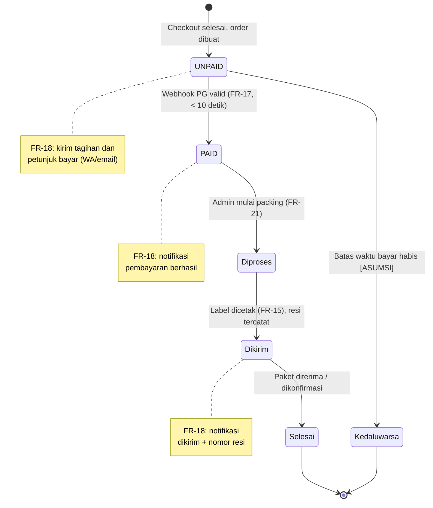
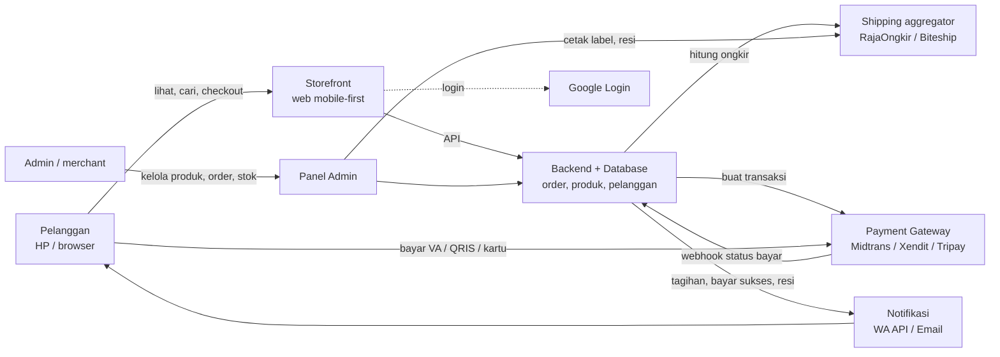

# PRD — Modern Web E-Commerce Platform (D2C & Retail)
Perusahaan: Xavortree | Pemilik: PM (Sari) | Turunan dari: BRD.md v0.2 | Status: Draft — bahan meeting CEO 2026-09-28 | Versi: 0.2 (2026-09-27)

Riwayat versi: v0.1 (2026-09-26) draft awal. v0.2 (2026-09-27) pemilik toko terjawab (klien Xavortree, Q13 KEPUTUSAN.md), tanggal meeting dipindah ke 2026-09-28, bagian 7 dirapikan jadi agenda meeting. FR-01 s/d FR-22 tidak berubah.

Catatan: disusun atas instruksi CEO "buatkan aja pakai yang ada". Sumber hanya FR-01 s/d FR-22, NFR, roadmap, dan AC MVP di BRD v0.2. Item yang belum dijawab CEO ditandai [BUTUH KONFIRMASI CEO]; keputusan PM yang bisa dibatalkan ditandai [ASUMSI].

## 1. Ringkasan produk
Website toko online mandiri (brand-owned channel) untuk penjualan B2C/D2C ritel di Indonesia, dipakai pembeli dari HP (mobile-first) dan dioperasikan admin/merchant lewat panel admin. Pembeli bisa belanja dengan atau tanpa akun, mendapat ongkir real-time sesuai alamat dan berat, membayar via VA/QRIS/kartu, dan status pesanan berubah otomatis menjadi PAID lewat webhook dalam < 10 detik, lalu menerima notifikasi WA/email sampai nomor resi. Lebih baik dari kondisi sekarang karena tidak bergantung pada komisi marketplace (Shopee/Tokopedia), tidak ada verifikasi bukti transfer manual via WhatsApp, dan data pelanggan terkumpul di database sendiri. Pemilik toko: klien Xavortree (dikonfirmasi CEO 2026-09-27); Xavortree sebagai pengembang. Identitas klien spesifik (nama perusahaan, kontak, kontrak): [BUTUH KONFIRMASI CEO].

## 2. Persona dan alur utama
[ASUMSI] Persona di bawah diturunkan minimal dari FR, bukan dari riset. Demografi, jenis produk, pain point, dan volume transaksi menunggu CEO (persona detail bagian 2 BRD asli belum diterima). CEO bisa membatalkan.

| Persona | Dasar FR | Kebutuhan utama |
|---|---|---|
| P1 Pelanggan terdaftar | FR-01, FR-02, FR-03, FR-11 | Login cepat (email/WA/Google), alamat tersimpan, riwayat pesanan dan lacak resi, wishlist |
| P2 Pelanggan tamu (guest) | FR-04 | Belanja sekali tanpa daftar, checkout < 3 menit dari HP |
| P3 Admin/merchant | Modul 7, FR-15 | Pantau omzet dan order, proses order sampai kirim, cetak label thermal, stok menipis, ekspor laporan |
| (Pemangku kepentingan) Pemilik brand = klien Xavortree | BRD bagian 5 | Kanal penjualan sendiri, database pelanggan. Nama klien, kontak, kontrak: [BUTUH KONFIRMASI CEO] |

**Alur utama pelanggan (P1/P2):** cari/filter produk → pilih varian → keranjang (+ voucher) → isi/pilih alamat → pilih kurir (ongkir real-time) → pilih metode bayar → order dibuat UNPAID + tagihan WA/email → bayar → webhook PAID + notifikasi → dikirim + resi → Selesai.

**Alur utama admin (P3):** lihat order Sudah Bayar → ubah ke Diproses/Packing → cetak label thermal → input/terima resi, ubah ke Dikirim (notifikasi resi terkirim) → Selesai. Harian: cek dashboard omzet, low stock alert, ekspor laporan.

### 2.1 Diagram status transaksi end-to-end (DRAFT PM — bukan diagram asli CEO, divalidasi di meeting 2026-09-28)
[ASUMSI] Diagram disusun PM dari FR-17, FR-18, FR-21, dan BRD bagian 4, karena diagram asli CEO belum diterima. Status "Kedaluwarsa/Batal" ditambahkan PM karena VA/QRIS punya batas waktu; perilaku detailnya diputuskan Analyst di FD.

Pemetaan istilah: UNPAID = "Pending", PAID = "Sudah Bayar" di FR-21.

### 2.2 Diagram alur data tingkat tinggi (DRAFT PM — bukan diagram asli CEO dan bukan arsitektur final, divalidasi di meeting 2026-09-28)
[ASUMSI] Hanya gambaran aliran data untuk diskusi meeting. Komponen, vendor final, dan batas sistem diputuskan Analyst di FD/TDD.

## 3. Fitur (prioritas MoSCoW)
Aturan prioritas [ASUMSI]: Must = dibutuhkan untuk AC MVP 1–5 di BRD bagian 8 (jalur beli → bayar → kirim, admin inti). Should = masuk MVP, bisa dikerjakan ringan dulu. Could = masuk MVP, tapi pertama digeser bila minggu 7 molor (sejalan risiko R1 BRD). Tidak ada FR yang dikeluarkan dari scope; menggeser Could ke fase berikutnya tetap lewat /revisi.

| ID | Fitur | Prioritas | User story | Acceptance criteria |
|---|---|---|---|---|
| FR-01 | Registrasi & login via email, nomor WhatsApp, atau Google | Must (Google login: Should) | Sebagai pelanggan, saya ingin daftar/masuk dengan cara yang saya punya supaya tidak repot membuat password baru. | 1) Diberikan pengunjung belum punya akun, ketika mendaftar dengan email valid dan password, maka akun dibuat dan pengunjung langsung masuk. 2) Diberikan nomor WA terdaftar, ketika pelanggan meminta login via WA dan memasukkan kode verifikasi yang benar, maka pelanggan masuk; kode salah ditolak dengan pesan error. 3) Diberikan akun Google, ketika pelanggan klik "Masuk dengan Google" dan menyetujui, maka akun dibuat/ditautkan dan pelanggan masuk tanpa mengisi form. 4) Diberikan email sudah terdaftar, ketika mendaftar ulang dengan email sama, maka sistem menolak dan menawarkan login. |
| FR-02 | Buku alamat banyak alamat + autocomplete wilayah | Must | Sebagai pelanggan, saya ingin menyimpan beberapa alamat supaya checkout berikutnya cepat. | 1) Diberikan pelanggan login, ketika mengetik nama kecamatan minimal 3 huruf, maka muncul saran provinsi–kota/kabupaten–kecamatan–kode pos yang bisa dipilih. 2) Diberikan pelanggan menyimpan 2+ alamat, ketika checkout, maka semua alamat tampil dan satu bisa dipilih sebagai tujuan. 3) Diberikan alamat dipilih dari autocomplete, ketika ongkir dihitung, maka ID wilayah yang dipakai cocok dengan vendor ongkir (ongkir berhasil keluar, bukan error). |
| FR-03 | Riwayat pesanan + lacak resi | Must | Sebagai pelanggan terdaftar, saya ingin melihat pesanan dan posisi paket saya. | 1) Diberikan pelanggan punya 3 pesanan, ketika membuka Riwayat Pesanan, maka ketiganya tampil urut terbaru dengan status terkini. 2) Diberikan pesanan berstatus Dikirim dengan resi, ketika klik "Lacak", maka tampil status pelacakan terbaru dari kurir. 3) Diberikan pesanan belum dikirim, ketika dilihat, maka tombol Lacak tidak aktif. |
| FR-04 | Guest checkout | Must | Sebagai pembeli baru, saya ingin langsung beli tanpa daftar supaya cepat. | 1) Diberikan pengunjung tidak login, ketika checkout dengan mengisi nama, nomor WA/email, dan alamat, maka order dibuat tanpa akun. 2) Diberikan order tamu dibuat, ketika dibuat, maka tagihan terkirim ke kontak yang diisi (FR-18). 3) Diberikan penguji mengukur waktu dari halaman produk sampai halaman pembayaran di HP, ketika memakai guest checkout, maka selesai < 3 menit. |
| FR-05 | Kategori bertingkat | Must | Sebagai pelanggan, saya ingin menelusuri produk lewat kategori seperti Pria > Pakaian > Jaket. | 1) Diberikan kategori 3 level, ketika pelanggan membuka "Pria", maka subkategori tampil dan bisa diklik sampai level 3. 2) Diberikan produk di "Jaket", ketika membuka "Pakaian", maka produk dari semua subkategori di bawahnya ikut tampil. 3) Diberikan admin membuat kategori baru di bawah kategori lain, ketika disimpan, maka kategori tampil di storefront pada posisi yang benar. |
| FR-06 | Varian multi-dimensi (ukuran, warna, material) dengan harga & stok sendiri | Must | Sebagai pelanggan, saya ingin memilih kombinasi varian dan melihat harga serta stok yang tepat. | 1) Diberikan produk dengan varian ukuran × warna, ketika pelanggan memilih kombinasi, maka harga dan stok kombinasi itu yang tampil. 2) Diberikan kombinasi stok 0, ketika dipilih, maka tombol "Tambah ke keranjang" nonaktif dan tertulis habis. 3) Diberikan order PAID untuk satu varian, ketika status berubah, maka stok varian itu (bukan varian lain) berkurang sesuai jumlah. |
| FR-07 | Galeri foto dengan zoom + video preview | Should (video: Could) | Sebagai pelanggan, saya ingin melihat detail produk sebelum membeli. | 1) Diberikan produk dengan 3+ foto, ketika pelanggan menggeser galeri di HP, maka foto berganti. 2) Diberikan foto produk, ketika diketuk/di-pinch, maka foto diperbesar. 3) Diberikan produk punya video, ketika membuka halaman, maka video bisa diputar tanpa meninggalkan halaman. 4) Diberikan foto diunggah admin, ketika ditampilkan, maka file yang dikirim ke browser berformat .webp atau .avif. |
| FR-08 | Filter & pengurutan | Should | Sebagai pelanggan, saya ingin mengurutkan produk menurut harga, terbaru, terlaris, rating. | 1) Diberikan daftar produk, ketika memilih "Harga termurah", maka produk urut naik menurut harga. 2) Diberikan pilihan "Terbaru"/"Terlaris"/"Rating", ketika dipilih, maka urutan sesuai tanggal dibuat / jumlah terjual / rating. 3) Diberikan filter rentang harga, ketika diterapkan, maka hanya produk dalam rentang yang tampil. |
| FR-09 | Instant search dengan fuzzy (salah ketik) | Could (instant search dasar: Should) | Sebagai pelanggan, saya ingin menemukan produk walau salah ketik. | 1) Diberikan produk "Sneakers", ketika mengetik "sneak", maka saran muncul saat mengetik tanpa menekan Enter. 2) Diberikan produk "Sneakers", ketika mengetik "snekers", maka produk itu tetap muncul di hasil. 3) Diberikan kata tanpa hasil, ketika dicari, maka tampil pesan "tidak ditemukan" dan saran kategori. |
| FR-10 | Keranjang tersimpan otomatis | Must | Sebagai pelanggan, saya ingin isi keranjang tidak hilang saat refresh atau kembali nanti. | 1) Diberikan keranjang berisi 2 item, ketika browser di-refresh, maka 2 item tetap ada. 2) Diberikan tamu mengisi keranjang lalu login, ketika login berhasil, maka isi keranjang tamu tergabung ke akun. 3) Diberikan jumlah item diubah, ketika disimpan, maka subtotal diperbarui dan jumlah tidak bisa melebihi stok. |
| FR-11 | Wishlist | Could | Sebagai pelanggan terdaftar, saya ingin menyimpan produk favorit untuk dibeli nanti. | 1) Diberikan pelanggan login, ketika klik ikon favorit, maka produk masuk Wishlist dan tetap ada setelah logout-login. 2) Diberikan tamu klik favorit, ketika diklik, maka diminta login. 3) Diberikan produk di wishlist, ketika klik hapus, maka produk hilang dari wishlist. |
| FR-12 | Kupon & voucher (persen, nominal, gratis ongkir min. belanja, kuota per akun) | Should | Sebagai pelanggan, saya ingin memakai voucher; sebagai admin, saya ingin membatasi pemakaiannya. | 1) Diberikan voucher 10% aktif, ketika dipakai pada subtotal Rp200.000, maka potongan Rp20.000. 2) Diberikan voucher nominal Rp25.000, ketika dipakai, maka total berkurang Rp25.000 dan tidak di bawah Rp0. 3) Diberikan voucher gratis ongkir min. Rp150.000, ketika subtotal Rp100.000, maka voucher ditolak dengan alasan; ketika Rp150.000+, maka ongkir jadi Rp0 (atau dipotong sampai batas voucher). 4) Diberikan kuota 1 kali per akun dan sudah dipakai, ketika dipakai lagi oleh akun sama, maka ditolak. 5) Diberikan voucher kedaluwarsa, ketika dipakai, maka ditolak. |
| FR-13 | Kalkulator ongkir otomatis (RajaOngkir/Biteship): reguler/kargo dan instant | Must | Sebagai pelanggan, saya ingin melihat ongkir dan pilihan kurir sesuai alamat saya. | 1) Diberikan alamat tujuan dan keranjang berberat tertentu, ketika masuk langkah pengiriman, maka tampil daftar kurir (min. JNE, SiCepat, J&T, Anteraja) dengan harga dan estimasi hari. 2) Diberikan alamat dalam jangkauan instant, ketika dihitung, maka opsi GoSend/GrabExpress muncul; di luar jangkauan tidak muncul. 3) Diberikan harga dari API vendor, ketika dibandingkan dengan ongkir di checkout, maka nilainya sama. 4) Diberikan API ongkir gagal/timeout, ketika dihitung, maka tampil pesan coba lagi dan order tidak bisa dibuat tanpa ongkir. |
| FR-14 | Berat volumetrik otomatis | Should | Sebagai admin, saya ingin ongkir memakai berat yang benar supaya tidak rugi selisih ongkir. | 1) Diberikan produk berdimensi P×L×T cm dan berat aktual, ketika ongkir dihitung, maka berat yang dipakai = max(berat aktual, P×L×T/6000) [ASUMSI pembagi 6000; final mengikuti aturan vendor di FD]. 2) Diberikan produk tanpa dimensi, ketika dihitung, maka berat aktual yang dipakai. |
| FR-15 | Cetak label pengiriman thermal PDF dari admin | Must | Sebagai admin, saya ingin mencetak label langsung dari panel. | 1) Diberikan order status Diproses, ketika admin klik "Cetak label", maka PDF ukuran label thermal terunduh berisi nama/alamat/kontak penerima, pengirim, kurir, dan nomor resi/booking. 2) Diberikan 5 order dipilih, ketika cetak massal, maka 1 PDF berisi 5 label. 3) Diberikan order belum PAID, ketika dilihat, maka tombol cetak label tidak tersedia. |
| FR-16 | Payment gateway (Midtrans/Xendit/Tripay): VA, QRIS, kartu 3DS, PayLater | Must (VA + QRIS); Should (kartu); Could (PayLater) | Sebagai pelanggan, saya ingin membayar dengan metode yang biasa saya pakai. | 1) Diberikan order dibuat dengan VA BCA, ketika halaman bayar tampil, maka nomor VA, nominal, dan batas waktu tampil. 2) Diberikan QRIS dipilih, ketika dipindai di sandbox, maka pembayaran tercatat. 3) Diberikan kartu kredit di sandbox, ketika bayar, maka muncul langkah OTP 3-D Secure. 4) Diberikan database aplikasi diperiksa setelah transaksi kartu, ketika dicari, maka tidak ada nomor kartu tersimpan (PCI-DSS). |
| FR-17 | Webhook pembayaran instan UNPAID → PAID < 10 detik | Must | Sebagai admin dan pelanggan, saya ingin status bayar berubah otomatis tanpa kirim bukti transfer. | 1) Diberikan order UNPAID, ketika PG sandbox mengirim notifikasi lunas, maka status jadi PAID dalam < 10 detik sejak notifikasi dikirim. 2) Diberikan notifikasi dengan signature tidak valid, ketika diterima, maka ditolak dan status tidak berubah. 3) Diberikan notifikasi lunas yang sama dikirim 2 kali, ketika diproses, maka status tetap PAID sekali, stok tidak berkurang dua kali, notifikasi pelanggan tidak terkirim dua kali. 4) Diberikan nominal notifikasi berbeda dari total order, ketika diterima, maka order tidak di-PAID-kan dan dicatat untuk admin. |
| FR-18 | Notifikasi otomatis WA/email: tagihan, bayar berhasil, dikirim + resi | Must | Sebagai pelanggan, saya ingin tahu status pesanan tanpa bertanya ke penjual. | 1) Diberikan order dibuat, ketika tersimpan, maka pesan tagihan berisi nominal, metode, dan batas bayar terkirim ke WA/email pelanggan dalam < 1 menit [ASUMSI batas waktu]. 2) Diberikan order jadi PAID, ketika status berubah, maka pesan "pembayaran berhasil" terkirim. 3) Diberikan admin mengubah status ke Dikirim dengan resi, ketika disimpan, maka pesan berisi kurir dan nomor resi terkirim. 4) Diberikan pengiriman WA gagal, ketika gagal, maka email tetap terkirim (jika ada) dan kegagalan tercatat di admin. |
| FR-19 | Dashboard ringkasan finansial | Should | Sebagai admin, saya ingin melihat omzet, jumlah order, dan barang terlaris sekilas. | 1) Diberikan 3 order PAID hari ini total Rp600.000, ketika membuka dashboard, maka omzet hari ini = Rp600.000 dan order masuk = 3. 2) Diberikan filter bulan, ketika dipilih, maka omzet bulanan sesuai jumlah order PAID bulan itu. 3) Diberikan order UNPAID/kedaluwarsa, ketika dihitung, maka tidak masuk omzet. 4) Diberikan data penjualan, ketika melihat "Terlaris", maka urutan sesuai jumlah unit terjual. |
| FR-20 | Manajemen inventori + low stock alert | Should | Sebagai admin, saya ingin tahu stok yang menipis sebelum habis. | 1) Diberikan ambang stok varian = 5, ketika stok turun ke 5 atau kurang, maka varian muncul di daftar "Stok menipis" dan admin mendapat notifikasi. 2) Diberikan admin mengubah stok manual, ketika disimpan, maka stok storefront ikut berubah. |
| FR-21 | Order pipeline: Pending → Sudah Bayar → Diproses/Packing → Dikirim → Selesai | Must | Sebagai admin, saya ingin memproses order per tahap dengan jelas. | 1) Diberikan daftar order, ketika admin memfilter per status, maka hanya order status itu yang tampil. 2) Diberikan order Sudah Bayar, ketika admin mengubah ke Diproses lalu Dikirim (dengan resi), maka status berubah berurutan dan tercatat waktu serta pengubahnya. 3) Diberikan order Pending, ketika admin mencoba mengubah langsung ke Dikirim, maka ditolak. 4) Diberikan status berubah, ketika pelanggan membuka riwayat pesanan, maka status yang sama tampil (FR-03). |
| FR-22 | Ekspor laporan transaksi Excel/CSV | Should | Sebagai admin/pemilik, saya ingin mengekspor transaksi untuk pembukuan. | 1) Diberikan rentang tanggal, ketika klik ekspor CSV, maka file terunduh berisi semua order di rentang itu dengan kolom min. nomor order, tanggal, pelanggan, item, subtotal, diskon, ongkir, total, metode bayar, status. 2) Diberikan file yang sama, ketika dibuka di Excel, maka karakter dan angka terbaca benar. 3) Diberikan pilihan format Excel, ketika diekspor, maka file .xlsx terunduh dengan isi sama. |

Ringkasan: Must 13, Should 7, Could 2 (FR-09 fuzzy, FR-11) plus sub-bagian Could (video FR-07, PayLater FR-16).

### 3.1 Acceptance criteria rilis MVP (dari BRD bagian 8)
1. Diberikan produk tersedia, ketika pelanggan (terdaftar dan tamu) membeli sampai bayar di sandbox, maka notifikasi pembayaran sukses diterima tanpa langkah manual.
2. Diberikan alamat tujuan dan berat barang, ketika checkout, maka ongkir terhitung otomatis dan sesuai vendor.
3. Diberikan pembayaran lunas di sandbox, ketika webhook diterima, maka status PAID tanpa verifikasi manual admin.
4. Diberikan akun admin, ketika mengelola produk, memantau order, dan mencetak label thermal, maka semua bisa dilakukan dari panel admin.
5. Diberikan halaman beranda, kategori, dan produk diuji di Google PageSpeed Insights mode Mobile, ketika diukur, maka skor performa > 85 untuk ketiganya.

## 4. Non-fungsional
- **Performa:** First Contentful Paint < 1.8 detik (mobile, PageSpeed Insights); skor Core Web Vitals/performa mobile > 85; gambar otomatis dikompresi ke .webp/.avif.
- **Perangkat:** mobile-first, nyaman satu tangan di layar smartphone; tetap responsif di tablet/desktop. [ASUMSI] Diuji minimal di Chrome Android dan Safari iOS versi terbaru.
- **Keamanan:** HTTPS penuh (TLS) di semua halaman; PCI-DSS dengan cara data kartu hanya ditangani payment gateway, server tidak menyimpan nomor kartu; webhook diverifikasi signature dan idempoten (dari catatan Analyst di BRD).
- **Privasi:** [ASUMSI] persetujuan (consent) pelanggan untuk menyimpan data dan menerima notifikasi WA/email, sesuai UU PDP (risiko R3 BRD).
- **SEO:** URL bersih (contoh /produk/sepatu-sneakers-pria); OpenGraph otomatis untuk share ke WhatsApp/Instagram; Schema.org Product (harga dan stok) untuk rich snippet Google.
- **Bahasa:** [ASUMSI] storefront dan admin Bahasa Indonesia, mata uang Rupiah.
- **Aksesibilitas:** [ASUMSI] kontras teks dan ukuran area sentuh wajar untuk HP (target skor Accessibility PageSpeed > 85); tidak ada target WCAG formal di BRD.

## 5. Ketergantungan dan integrasi
| Integrasi | Vendor kandidat (BRD) | Dipakai di | Ketergantungan / catatan |
|---|---|---|---|
| Payment gateway | Midtrans / Xendit / Tripay | FR-16, FR-17 | Akun merchant + KYC badan usaha/rekening, bisa 1–3 minggu (R2). Harus didaftarkan CEO paling lambat minggu 1. Satu vendor dipilih sebelum TDD. |
| Ongkir dan label | RajaOngkir Pro / Biteship | FR-02, FR-13, FR-14, FR-15 | Data wilayah FR-02 harus cocok dengan ID area vendor terpilih. Instant (GoSend/Grab) butuh koordinat/aktivasi. |
| WhatsApp API | Fonnte / Waha / Whapi | FR-01 (login WA), FR-18 | API tidak resmi berisiko nomor diblokir (R4). Butuh nomor WA khusus toko. Pilihan final di TDD. |
| Email | [ASUMSI] layanan email transaksional, dipilih di TDD | FR-01, FR-18 | Butuh domain toko. |
| Google Login | Google OAuth | FR-01 | Butuh domain dan akun Google Cloud milik pemilik toko. |
| Hosting | Vercel + VPS/AWS (rekomendasi CEO) | Semua | Final di TDD. Repo kode dan lingkungan masih [BLOKIR] di konteks perusahaan. |

[ASUMSI] Karena pemilik toko adalah klien, akun PG, ongkir, WA, domain, dan Google Cloud didaftarkan atas nama badan usaha klien (KYC PG butuh dokumen klien); tim hanya memegang akses teknis. Siapa klien dan kapan dokumen KYC tersedia: [BUTUH KONFIRMASI CEO].

Urutan pengerjaan mengikuti roadmap 8 minggu BRD bagian 7; TIMELINE.md rinci ditulis setelah meeting 2026-09-28 (butuh identitas klien, budget, dan keputusan platform custom vs headless).

## 6. Di luar scope versi ini
- Ekspansi B2B grosir (harga grosir, akun reseller) — fase berikutnya. [ASUMSI dari BRD]
- Loyalty program dan kampanye marketing email/WA (broadcast promosi). MVP hanya mengumpulkan data pelanggan dan notifikasi transaksi. [ASUMSI dari BRD]
- COD (bayar di tempat) — tidak disebut di FR-16. [ASUMSI dari BRD]
- [ASUMSI PM] Retur/refund otomatis dan multi-gudang tidak ada di FR; ditangani manual di luar sistem pada MVP.

## 7. Agenda meeting CEO 2026-09-28

### 7.1 Sudah terjawab
| No | Pertanyaan | Jawaban CEO | Sumber |
|---|---|---|---|
| 1 | Toko ini untuk siapa? | **TERJAWAB: klien Xavortree** (opsi B), bukan brand internal. Sub-catatan: identitas klien spesifik (nama perusahaan, kontak, kontrak) masih [BUTUH KONFIRMASI CEO], lihat 7.2 no. 1. | Feedback dashboard 2026-09-27, KEPUTUSAN.md Q13 |
| - | Isi dokumen CEO lengkap? | Ya. Paste pertama terpotong, lanjutan sudah masuk BRD v0.2; FR-01 s/d FR-22, NFR, stack, roadmap, AC lengkap. | Feedback dashboard 2026-09-27 |
| - | Tunggu file/diagram asli atau lanjut? | Lanjut pakai materi yang ada ("buatkan aja pake yang ada"). Diagram 2.1 dan 2.2 tetap draft PM sampai divalidasi di meeting. | Feedback dashboard 2026-09-27 |

### 7.2 Perlu diputuskan CEO di meeting
1. **Identitas klien.** Nama perusahaan klien, PIC, status kontrak, dan siapa yang menyetujui rilis di sisi klien. [BUTUH KONFIRMASI CEO]
   A: CEO sebut sekarang di meeting. B: tim lanjut FD dengan nama placeholder "Klien D2C", identitas menyusul sebelum pendaftaran akun PG.
   Rekomendasi: A, karena KYC payment gateway (risiko R2, 1–3 minggu) butuh dokumen badan usaha klien di minggu 1.
2. **Budget pengembangan dan biaya operasional bulanan.** [BUTUH KONFIRMASI CEO]
   A: CEO/klien memberi pagu. B: tim menyusun estimasi biaya vendor bulanan (fee PG, ongkir, WA, hosting) sebagai [ASUMSI] berupa rentang.
   Rekomendasi: B bila pagu belum ada, karena harga vendor publik dan bisa dihitung cepat.
3. **Persona detail.** Persona minimal P1–P3 sudah diturunkan dari FR; yang kosong: jenis produk klien, demografi, pain point, volume order. [BUTUH KONFIRMASI CEO]
   A: CEO beri detail di meeting. B: persona minimal dipakai untuk FD, detail menyusul dari klien.
   Rekomendasi: A untuk jenis produk dan volume order (berpengaruh ke varian FR-06 dan kapasitas), sisanya boleh B.
4. **Validasi diagram draft PM (bagian 2.1 dan 2.2).**
   A: CEO setujui sebagai acuan FD. B: CEO koreksi di meeting (misal status Kedaluwarsa/Batal, alur resi).
   Rekomendasi: A dengan koreksi kecil, karena diagram hanya merangkum FR-17, FR-18, FR-21.
5. **Persetujuan MoSCoW (bagian 3).** Must 13, Should 7, Could 2 (FR-09 fuzzy, FR-11 wishlist) plus sub-Could (video FR-07, PayLater FR-16).
   A: setujui apa adanya. B: CEO geser item tertentu.
   Rekomendasi: A, karena semua FR tetap di MVP; Could hanya yang pertama digeser bila minggu 7 molor (lewat /revisi).
6. **Platform custom vs headless (mis. Medusa).**
   A: tugaskan /riset perbandingan sebelum TDD. B: CEO putuskan langsung di meeting.
   Rekomendasi: A, karena ini penentu terbesar kelayakan 8 minggu (catatan Analyst di BRD).

### 7.3 Catatan lain (tidak memblokir PRD)
- Siapa mengisi konten katalog (produk, foto, video): [ASUMSI] klien sebagai pemilik brand, tim menyediakan import CSV.
- Pemegang akun pihak ketiga: [ASUMSI] atas nama klien (lihat bagian 5).
- Setelah meeting: PM menulis TIMELINE.md, Analyst mulai FD.
